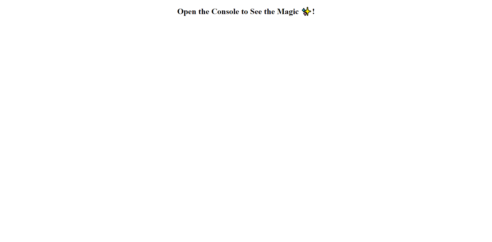
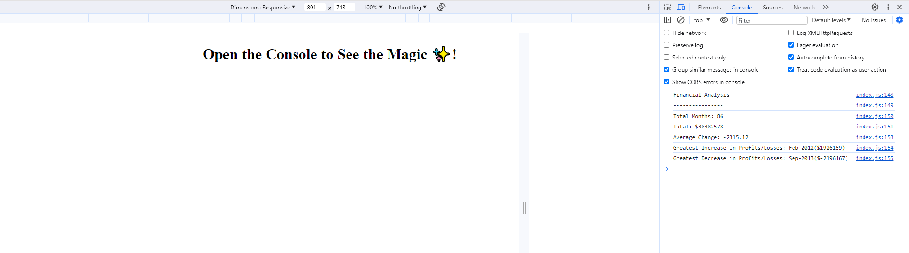

## Console-Finances
Link to Webpage: https://josh484.github.io/Console-Finances/
## Description 
This website is only a shell, where all the calculations for the task is outputted to the console. I was given an array with data where I had to output various answers using key aspects of javaScript. This task helped me understand the power of javaScript as well as get a basic understanding on how to use it effectively. 

## Installation
In order to install the project simply click the green code button and download the file as a zip. 
Once downloaded simply right click on the file and unzip the folder.
## Usage 
Once the file is downloaded you can open the index.html on your web browser you will be met with this page:

All calculations are outputted onto the console as stated in the homepage.
Shown here: 

## Features
Here are a list of features for this task.

- The first for loop goes through the finance array does 3 things:
1. gets the total amount of months.
2. gets the total net profit/loss
3. pushes the difference between 2 months where it takes the latter month against the earlier month into a new array called averages.
- The second for loop then goes through the averages array to sum up the differences. which is later used in the variable vtotal to get the total average.
- the third for loop goes through averages array again and does 3 things.
1. adds the averages array output into the 2nd column of finances. 
2. creates an if statement where if the the 2nd column of finances(the differences) is greater than greatest replace greatest with the date and difference. This is to get greatest increase in profit.
3. does the same thing as the 2nd but for the lowest decrease in profit.
- Lastly everything is then outputted to the console. 